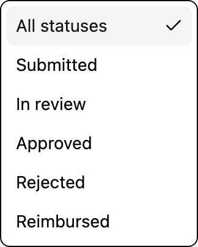

# Expenses list

All expenses visible to the current role, with filters.

| | |
|---|---|
| id | `expenses` |
| section | Expenses |
| template | `list-page` — `src/demo/templates/ListTemplate.tsx` |
| UI-kit components | Input, Select, Table, Badge, Button, Skeleton, Alert |
| fidelity | navigable |

## Dimensions

- **Role** (`role`): **Employee** (default) · Manager · Finance
- **Data state** (`state`): **Loaded** (default) · Empty · Error

## Pinned states (4)

- Role: Employee, Data state: Loaded
- Role: Manager, Data state: Loaded — Manager sees submitter column + quick actions
- Role: Employee, Data state: Empty
- Role: Employee, Data state: Error — API failure fallback with retry

## Semantic targets (`data-proto`)

- `SearchInput` — { component: "Input", mock: "not wired" }
- `StatusFilter` — { component: "Select", defaultForFinance: "approved" }
- `RetryButton` — { component: "Button" }
- `ExpenseTable` — { component: "Table", rows: rows.length, roleAware: "submitter column hidden for employees" }
- `ExpenseRow` — { component: "TableRow", expense: e.id, opensLifecycle: e.status }
- `AppTopBar` — { component: "AppFrame header", roleAware: true }

## Design annotations

1. **Mock data** (`ExpenseTable`) — Rows come from fixtures; totals are computed client-side. Clicking a row opens the detail page with the row's lifecycle stage.
2. **Status filter** (`StatusFilter`) — Filters by lifecycle stage. Finance defaults to 'Approved' because that's their work queue.

## Scenarios that pass through (3)

- **Employee submits an expense** — PRD-118 §2
  6. It shows up as Submitted → `ExpenseRow:exp-2101` (role=employee, state=loaded)
- **Manager reviews and approves** — PRD-118 §3, JIRA-ORB-412
  2. Open the submitted expense → `ExpenseRow:exp-2101` (role=manager, state=loaded)
- **Finance reimburses** — PRD-118 §4
  1. Open an approved expense → `ExpenseRow:exp-2102` (role=finance, state=loaded)

## Figures (1)

### Status filter menu

Cropped from the running list at role=employee. The menu is component state, not a URL, so it lives here as a figure rather than as a pinned instance.

1. **All statuses** — The default for employees and managers: the list hides nothing until someone chooses to.
2. **Current value** — The check marks the active filter; the trigger behind the menu reads the same label.
3. **Approved** — Finance opens the list already filtered to Approved, which is their actual work queue.

## Canvas notes

- Error copy agreed with support. Keep the retry; don't add a status page link yet.

_Generated from stavy.json — do not edit by hand._
